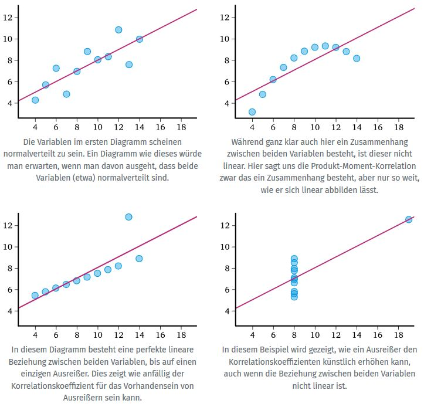
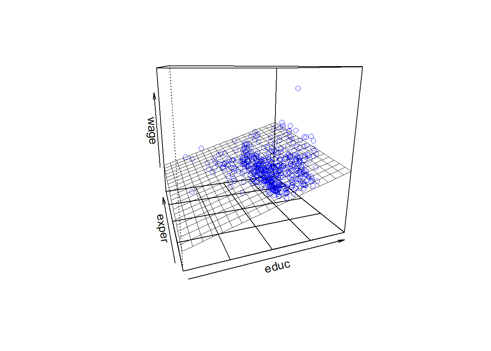

# (PART\*) Teil III: Modelle mit mehr Variablen {-}


# Korrelationen {-}

Korrelation ist ein Maß für den statistischen Zusammenhang zwischen zwei Datensätzen. Unabhängige Variablen sind daher stets unkorreliert. Korrelation impliziert daher auch stochastische Abhängigkeit. Durch Korrelation wird die lineare Abhängigkeit zwischen zwei Variablen quantifiziert.

Auch wenn Korrelation eine *deskriptive Statistik* ist, wird sie durch eine Reihe von Verfahren, wie z.B. partielle Korrelation, multiple Korrelation oder Faktorenanalyse, verfeinert. Es ist ein absolut unverzichtbares Werkzeug für viele Forschungsgebiete.

## Kausalität {-}

Eine relevante (statistisch signifikante) Korrelation liefert keinen Beleg für Kausalität. Vor allem in der Medizin und Psychologie suchen Forscher nach Kriterien für Kausalität. Es existieren mehrere Ansätze, nachfolgend seien hier die neun Kriterien von Hill (1965) angeführt:

1. *Stärke der Assoziation (Effektstärke)*: Eine geringe Effektsstärke bedeutet nicht, dass keine Beziehung zwischen den Variablen existiert, aber bei einer größeren Effektstärke ist eine kausale Beziehung wahrscheinlicher.
2. *Konsistenz (Reproduzierbarkeit)*: Übereinstimmende Befunde, festgestellt durch verschiedene Personen an verschiedenen Orten mit verschiedenen Stichproben, verstärkt die Wahrscheinlichkeit eines Effekts.
3. *Spezifität*: Kausalität ist wahrscheinlich, wenn es keine andere bessere Erklärung für das Auftreten des Ereignisses gibt. Je spezifischer die Beziehung zwischen einem Faktor und einem Effekt ist, desto höher die Wahrscheinlichkeit eines kausalen Zusammenhangs.
4. *Zeitbedingtheit*: Die Ursache muss der Wirkung vorausgehen (wenn erwartet wird, dass es eine Verzögerung nach der Ursache und dem erwarteten Effekt gibt, dann muss der Effekt nach der Verzögerung eintreten).
5. *Dosis-Wirkungs-Beziehung*: Größere Exposition sollte gewöhnlich auch zu einer größeren Auftretenshäufigkeit des Effekts führen. In einigen Fällen jedoch kann bereits die bloße Anwesenheit eines Faktors einen Effekt auslösen. In anderen Fällen wird der umgekehrte Fall beobachtet: die Anwesenheit eines Faktors reduziert die Auftretenshäufigkeit.
6. *(Biologische) Plausibilität*: Ein plausibler Mechanismus zwischen Ursache und Wirkung ist hilfreich (allerdings fügte Hill auch hinzu, dass das Verständnis von Ursache und Wirkung durch unseren aktuellen Wissensstand begrenzt sein kann).
7. *Koheränz*: Die Stimmigkeit zwischen epidemiologischen- und Laborbefunden erhöht die Wahrscheinlichkeit eines Effekts. Hill fügte allerdings hinzu, dass das Fehlen eines Laborbefundes nicht einen epidemiologischen Effekt auf die Beziehung ungültig machen kann.
8. *Experiment*: Es ist wahrscheinlicher, dass eine Beziehung kausal ist, wenn sie experimentell verifiziert werden kann.
9. *Analogie*: Der Effekt ähnlicher Faktoren darf berücksichtigt werden.

## Linearität {-}

Ein Korrelationskoeffizient zeigt die Stärke eines *linearen Zusammenhangs* zwischen zwei Variablen. Aber der Wert von $r$ charakterisiert nicht die genaue Art des Zusammenhangs oder das Aussehen des Punktdiagramms beider Variablen[^6].

[^6]: [Abbildungen aus Matheguru](https://matheguru.com/stochastik/korrelation-korrelationskoeffizient.html)

<center>

{ width=80% }

</center>

## Korrelationskoeffizienten {-}

Neben dem Pearson-Produkt-Moment-Korrelationskoeffizienten $r$ existieren noch etliche weitere Korrelationskoeffizienten und Zusammenhangsmaße. Die meisten hiervon sind Sonderfälle der Pearson-Produkt-Moment-Korrelation. Die Tabelle (unten) zeigt, wann welcher Koeffizient berechnet werden soll, abhängig von dem Skalenniveau der beteiligten Variablen.

<center>

{ width=100% }

</center>

Weiter Infos zu den einzelnen Korrelationskoeffizienten sind der Literatur zu entnehmen. Eine übersichtliche Darstellung findet man auch unter folgendem [Link](https://matheguru.com/stochastik/korrelation-korrelationskoeffizient.html).

## Modell {-}

Bereits bei der deskriptiven Statistik haben wir mit dem Maß der Varianz ($s^2$) einen Kennwert definiert, der die Schwankungen bezüglich des entsprechenden Mittelwertes beschreibt. Per Definition ist die Varianz die durchschnittliche Summe der quadrierten Abweichungen zum Mittelwert, also:

\begin{equation} 
  s^2 = \frac{\sum_{i=1}^{N} (x_i - \bar{x})^2}{N-1}
  (\#eq:Var)
\end{equation} 

Betrachtet man zwei (normalverteilte) intervallskalierte Variablen $x$ und $y$, dann lässt sich diese Idee auch als ein Kennwert der gemeinsamen Variablität der beiden Variablen definieren:

\begin{equation} 
  cov(x,y) = \frac{\sum_{i=1}^{N} (x_i - \bar{x}) \cdot (y_i - \bar{y})}{N-1}
  (\#eq:Cov)
\end{equation} 

Dieser Kennwert nennt sich *Kovarianz* ($cov$). Da dieser Kennwert an die entsprechenden Einheiten der Variablen gebunden ist, normiert man i.A. dieses Maß durch das Produkt der jeweiligen Standardabweichung $s_x$ und $s_y$. Dieses normierte Maß bezeichnet man als *Korrelationskoeffizient* ($r$):

\begin{equation} 
  r(x,y) = \frac{cov(x,y)}{s_x \cdot s_y}
  (\#eq:Korr)
\end{equation}

### Beispiel {-}

Anhand des bereits verwendeten Datensatzes (*CPS85*) wollen wir die Beziehung der Variablen Gehalt (*wage*), Ausbildung (*educ*) und Berufserfahrung (*exper*) berechnen und graphisch darstellen. Kopiere den folgenden Code ins RStudio und führe diesen dann aus. Diskutiere die Ergebnisse.


```r
  M      <- data.frame(wage = CPS85$wage, educ = CPS85$educ, exper = CPS85$exper)
  Korr_1 <- cor(M)
  pander(Korr_1, style = "rmarkdown")
  # DT::datatable(round(Korr_1,2))
  corrplot(cor(M), method = "ellipse")
```

# Einfache Regression {-}

Die Regression basiert auf der Korrelation und ermöglicht die bestmögliche Vorhersage für eine Variable. Im Gegensatz zur Korrelation muss hierbei festgelegt werden, welche Variable durch eine andere Variable vorhergesagt werden soll. Die Variable die vorhergesagt werden soll nennt man bei der Regression *Kriterium* ($y_i$). Die Variable die für die Vorhersage eingesetzt wird bezeichnet man als *Prädiktor* ($x_1i$)[^7]. Anhand des Prädiktors wird demzufolge das Kriterium vorhergesagt.

[^7]: wobei die 1 für den ersten (einzigen) Prädiktor und $i$ als Index für die $i$-te Beobachtung steht.

## Definition {-}

Die formale Definition eines einfachen linearen Modells ist:

\begin{equation} 
  y_i = b_0 + b_1 \cdot x_{1i} + \varepsilon_i
  (\#eq:LinModFehler)
\end{equation}

Die wesentlichen Parameter dieses einfachen Modells sind:

1. Intercept $b_0$: jener Wert den $y_i$ einnimmt, wenn $x_{1i} = 0$ ist.
2. Steigung $b_1$: die Zunahme von $y_i$, wenn $x_{1i}$ sich um eine Einheit erhöht.

Des Weiteren berücksichtigt dieses Modell auch einen Fehler ($\varepsilon_i$). Damit kommt auch ein ganz zentraler Teil bei der Modellbildung zum Ausdruck. Die meisten Modelle definieren sich also aus:

\begin{equation} 
  \textrm{wahrer Wert} = \textrm{Modell} + \textrm{Fehler}
  (\#eq:AllgModellvorstellung)
\end{equation}

Daraus lässt sich auch folgende Erkenntnis bezüglich des Modells direkt ableiten:

1. Je kleiner die Summe der Fehler sind, desto besser ist das Modell.
2. Je genauer das Modell, desto kleiner wird auch der Fehler sein.

Mit dieser Erkenntnis wird auch klar, dass i.A. ein ganz einfaches Modell (mit einem einzigen Prädiktor) nur zu einer bedingten Reduktion des Fehlers geeignet ist. Wir werden uns im weiteren Verlauf mit erweiterten Modellen beschäftigen, wollen aber zunächst die Eigenschaften des einfachen linearen Modells näher betrachten. Im folgenden Link findet man eine gute [Veranschaulichung des einfachen linearen Modells](https://phet.colorado.edu/sims/html/least-squares-regression/latest/least-squares-regression_en.html).

Betrachtet man das Modell isoliert (also ohne Fehlerterm), ist folgende Schreibweise üblich:

\begin{equation} 
  \hat{y}_i = b_0 + b_1 \cdot x_{1i}
  (\#eq:LinMod)
\end{equation}

### Berechnung der Koeffizienten {-}

Für die Berechnung der Koeffizienten wird das Kriterium der kleinste Quadrate (MLS) angewandet. Einfach ausgedrückt wird eine Gerade durch die beobachteten Daten gesucht, die folgenden Eigenschaften aufweist:

1. die Summe der quadratischen Abstände jeder Beobachtung zum entsprechenden Punkt auf der Geraden ist ein Minimum, also $\sum_{i=1}^{N} \varepsilon_i^2 = min$.
2. es gibt keine andere Gerade die eine kleinere Summe dieser Fehler liefert.

Die Berechnung der Parameter entspricht daher einer Extremwertaufgabe, d.h. die partiellen Ableitungen werden auf Null gesetzt. Daraus lassen sich dann die Parameter $b_0, b_1$ berechnent. Details dazu siehe [Wikipedia](https://de.wikipedia.org/wiki/Einfache_lineare_Regression).

## Modellanwendung {-}

Zur Anwendung eines einfachen linearen Modell betrachten wir wiederum die bereits bekannten Daten aus dem Datensatz *CPS85*. Diese Mal wollen wir das Gehalt (*wage*) durch die Ausbildungsdauer (*educ* in Jahren) vorhersagen. Formal lautet das Modell demnach:

\begin{equation} 
   \hat{\textrm{wage}} = b_0 + b_1 \cdot \textrm{educ}
  (\#eq:LinModBsp1)
\end{equation}

Die Werte der Parameter $b_0, b_1$ können für dieses Beispiel entsprechend der obigen Erläuterung folgendermaßen interpretiert werden:

1. Für eine Person mit keiner Ausbildung ($\textrm{wage} = x_{1i} = 0$) wird durch das Modell ein Einkommen $y_i = b_0$ vorhergesagt.
2. Erhöht man die Ausbildungsdauer $x_{1i}$ um ein Jahr, steigt der Gehalt $y_i$ um das $b_1$-fache an.

Kopiere zur Veranschaulichung folgenden Code in dein R-Script und führe diesen aus.


```r
  DF <- CPS85
  ggplot(CPS85, aes(x = educ, y = wage)) +
    geom_point() +
    geom_smooth(method=lm, se=FALSE) +
    theme_bw()
```


```r
  model_1     <- lm(wage ~ educ, data = CPS85)
  pander(summary(model_1))
```


---------------------------------------------------------------
     &nbsp;        Estimate   Std. Error   t value   Pr(>|t|)  
----------------- ---------- ------------ --------- -----------
 **(Intercept)**    -0.746      1.045      -0.7135    0.4758   

    **educ**        0.7505     0.07873      9.532    5.474e-20 
---------------------------------------------------------------


--------------------------------------------------------------
 Observations   Residual Std. Error   $R^2$    Adjusted $R^2$ 
-------------- --------------------- -------- ----------------
     534               4.754          0.1459       0.1443     
--------------------------------------------------------------

Table: Fitting linear model: wage ~ educ

Die in der Tabelle angegebenen Werte der Spalte **Estimate** entsprechen dabei den Parametern $b_0, b_1$ des Modells. Eine weitere wesentliche Kennzahl für die Interpretation des Modells ist der Spalte $R^2$ zu entnehmen. Dieser Wert wird als *Determinationskoeffizient*[^8] bezeichnet. Umgerechnet in \% (im vorliegenden Beispiel also 14.43\%) besagt der Wert, wie viel der Variablität des Gehaltes durch den Prädiktor Ausbilung erklärt wird. Wir werden im weiteren Verlauf noch öfter auf diesen Kennwert zurückkommen.

[^8]: häufig auch als Varianzaufklärung

Welche Gehälter würden für Ausbildungszeiten zwischen 10 und 14 Jahren vorhergesagt werden? Kopiere folgenden Code in dein R-Script und führe diesen aus. Änder auch den Wertebereich der Prädiktoren und beobachte was dabei passiert!


```r
  new_input <- data.frame(educ = 10:14)
  pander(predict(model_1, newdata = new_input), style = "rmarkdown")
```


------------------------------------
   1       2      3      4      5   
------- ------- ------ ------ ------
 6.759   7.509   8.26   9.01   9.76 
------------------------------------

Im Vergleich zum Mittelwert-Modell zeigt sich mit steigender Ausbildung ein höheres Einkommen. Der Fehler bei der Vorhersage des Einkommens wird sich daher durch diese Modellvorstellung verringern (mehr zur Abschätzung der Fehlerreduktion später).

## Residualanalyse {-}

Ein zentrales Thema der Modellbildung ist die Beurteilung und (statistische) Auswertung der Abweichungen des Modells von den Beobachtungen (Fehler, Residum). Folgende Kennwerte bilden die Möglichkeit, die Güte des Modells abzuschätzen:

1. *Vorhergesagte Werte*: vorhergesagte Werte der Regressionsgleichung (= Werte die auf der Geraden liegen).
      * Nicht standardisiert: der Wert, den das Modell für die abhängige Variable vorhersagt.
      * Standardisiert: $z$-Transformierte vorhergesagte Werte.
      * Korrigiert: der vorhergesagte Wert für einen Fall, wenn dieser Fall von der Berechnung der Regressionskoeffizienten ausgeschlossen ist.
      * Standardfehler des Mittelwerts: Standardfehler der vorhergesagten Werte. Ein Schätzwert der Standardabweichung des Durchschnittswertes der abhängigen Variablen für die Fälle, die dieselben Werte für die unabhängigen Variablen haben.
2. *Residuen*: tatsächliche Wert der abhängigen Variablen minus des vorhergesagten Werts aus der Regressionsgleichung.
      * Nicht standardisiert: Die Differenz zwischen einem beobachteten Wert und dem durch das Modell vorhergesagten Wert.
      * Standardisiert: Der Quotient aus dem Residuum und einer Schätzung seiner Standardabweichung. Standardisierte Residuen, auch bekannt als Pearson-Residuen, haben einen Mittelwert von 0 und eine Standardabweichung von 1.
      * Studentisiert: Ein Residuum, das durch seine geschätzte Standardabweichung geteilt wird, die je nach der Distanz zwischen den Werten der unabhängigen Variablen des Falles und dem Mittelwert der unabhängigen Variablen von Fall zu Fall variiert.
      * Ausgeschlossen: Das Residuum für einen Fall, wenn dieser Fall nicht in die Berechnung der Regressionskoeffizienten eingegangen ist. Dies ist die Differenz zwischen dem Wert der abhängigen Variablen und dem korrigierten Schätzwert.
      * Studentisiert und ausgeschlossen: Der Quotient aus dem ausgeschlossenen Residuum eines Falles und seinem Standardfehler. Die Differenz zwischen einem studentisierten ausgeschlossenen Residuum und dem zugehörigen studentisierten Residuum gibt an, welchen Unterschied die Entfernung eines Falles für dessen eigene Vorhersage bewirkt.
3. *Distanzen*: Maße zum Auffinden von Fällen mit ungewöhnlichen Wertekombinationen bei den unabhängigen Variablen und von Fällen, die einen großen Einfluss auf das Modell haben könnten.
      * Mahalanobis: Dieses Maß gibt an, wie weit die Werte der unabhängigen Variablen eines Falls vom Mittelwert aller Fälle abweichen. Eine große Mahalanobis-Distanz charakterisiert einen Fall, der bei einer oder mehreren unabhängigen Variablen Extremwerte besitzt.
      * Cook: Ein Maß dafür, wie stark sich die Residuen aller Fälle ändern würden, wenn ein spezieller Fall von der Berechnung der Regressionskoeffizienten ausgeschlossen würde. Ein großer Wert der Cook-Distanz zeigt an, dass der Ausschluss eines Falles von der Berechnung der Regressionskoeffizienten die Koeffizienten substanziell verändert.
      * Hebelwerte: Werte, die den Einfluss eines Punktes auf die Anpassung der Regression messen. Der zentrierte Wert für die Hebelwirkung bewegt sich zwischen 0 (kein Einfluss auf die Anpassung) und $(N-1)/N$.
4. *Vorhersageintervalle*: obere und untere Grenzen sowohl für Mittelwert als auch für einzelne Vorhersageintervalle.
      * Mittelwert: Unter- und Obergrenze (zwei Variablen) für das Vorhersageintervall für den mittleren vorhergesagten Wert.
      * Individuell: Unter- und Obergrenzen (zwei Variablen) für das Vorhersageintervall der abhängigen Variablen für einen Einzelfall.
      * Konfidenzintervall: Geben Sie einen Wert zwischen 1 und 99,99 ein, um das Konfidenzniveau für die beiden Vorhersageintervalle festzulegen. Wählen Sie *Mittelwert* oder *Individuell* aus, bevor Sie diesen Wert eingeben. Typische Werte für Konfidenzniveaus sind 90, 95 und 99.
5. *Einflussstatistiken*: Änderung in den Regressionskoeffizienten (DfBeta(s)) und vorhergesagten Werten (DfFit), die sich aus dem Ausschluss eines bestimmten Falls ergeben. 
      * Differenz in Beta: entspricht der Änderung im Regressionskoeffizienten, die sich aus dem Ausschluss eines bestimmten Falls ergibt. Für jeden Term im Modell, einschließlich der Konstanten, wird ein Wert berechnet.
      * Standardisiertes DfBeta: die Änderung des Regressionskoeffizienten, die sich durch den Ausschluss eines bestimmten Falls ergibt. Es empfiehlt sich, Fälle mit absoluten Werten größer als $2/\sqrt{N}$ zu überprüfen, wenn $N$ die Anzahl der Fälle darstellt. Für jeden Term im Modell, einschließlich der Konstanten, wird ein Wert berechnet.
      * DfFit: Differenz im Anpassungswert ist die Änderung im vorhergesagten Wert, die sich aus dem Ausschluss eines bestimmten Falls ergibt.
      * Standardisiertes DfFit: Änderung des vorhergesagten Werts, die sich durch den Ausschluss eines bestimmten Falls ergibt. Es empfiehlt sich, Fälle mit absoluten Werten $> 2/\sqrt{p/N}$ zu überprüfen, wobei $p$ die Anzahl der unabhängigen Variablen im Modell und $N$ die Anzahl der Fälle darstellt.
      * Kovarianzverhältnis: Verhältnis der Determinante der Kovarianzmatrix bei Ausschluss eines bestimmten Falls von der Berechnung der Regressionskoeffizienten zur Determinante der Kovarianzmatrix bei Einschluss aller Fälle. Wenn der Quotient dicht bei 1 liegt, beeinflusst der ausgeschlossene Fall die Kovarianzmatrix nur unwesentlich.


```r
  CPS85_Res <- data.frame(Res     = round(resid(model_1), 2),
                          StdRes  = round(rstandard(model_1), 2),
                          StudRes = round(rstudent(model_1), 2),
                          # Cook    = round(cooks.distance(model_1), 2),
                          # DFBeta  = round(dfbeta(model_1), 2),
                          DF5Fit  = round(dffits(model_1), 2),
                          # Lev     = round(hatvalues(model_1), 2),
                          CovRat  = round(covratio(model_1), 2))
  pander(head(CPS85_Res))
```


--------------------------------------------
  Res    StdRes   StudRes   DF5Fit   CovRat 
------- -------- --------- -------- --------
 2.24     0.47     0.47      0.03     1.01  

 -2.76   -0.58     -0.58    -0.03      1    

 -4.46   -0.94     -0.94    -0.04      1    

 2.24     0.47     0.47      0.02     1.01  

 6.74     1.42     1.42      0.07      1    

 -2.26   -0.48     -0.48    -0.03     1.01  
--------------------------------------------

Mit der Residualanalyse kann man auf relativ einfache Weise jene Werte ermitteln (und auch graphisch darstellen), die z.B. um mehr als eine Standardabweichung abweichen. Diese Werte könnte man nochmals genauer untersuchen und gegebenenfalls vor einer weiterführenden Analyse ausschließen[^9]. Keinesfalls sollte sie jedoch dazu verwendet werden, um einen erwünschten Effekt durch schrittweises löschen störender Daten zu erreichen! Kopiere folgenden Code in dein R-Script und führe diesen aus.

[^9]: der Ausschluss von Werten ist nur dann erlaubt, wenn eine entsprechende Begründung (nachvollziehbarer Messfehler, falsche Datenübertragung, etc.) vorliegt!


```r
  # Liste standardisierte Residuen > |1|
  Ind_Res <- which((CPS85_Res$StdRes > 1 | CPS85_Res$StdRes < -1) == TRUE)
  # Anzeige der Werte von wage und educ sowie der Standardisierten Residuen
  # für jene Fälle, deren Residuen über 1 SD abweichen.
  
  # pander(data.frame(Indizes = Ind_Res,
  #                   wage = CPS85$wage[Ind_Res],
  #                   educ = CPS85$educ[Ind_Res] ,
  #                   CPS85_Res$StdRes[Ind_Res]))
  
  p_Res1 <- ggplot(CPS85, aes(x = educ, y = wage)) + 
            geom_point() +
            geom_point(data=CPS85[Ind_Res,],colour="red",size=3) +
            theme_bw()
  print(p_Res1, comment = FALSE)
```


# Multiple Regression {-}

Man könnte nun die bereits erwähnte Variable Erfahrung (*exper*) ins Modell aufnehmen. Der bereits aus der Korrelation ersichtliche (negative) Zusammenhang mit der Ausbildung *educ* lässt den Schluss auf eine Kovariabilität der beiden Variablen zu. Man nennt derartige Variablen auch **Kovariate**. Im linearen Modell wird diese jedoch wie eine weitere Variable (ein weiterer Prädiktor) zur Vorhersage des Kriteriums verwendet.

## Definition {-}

Die formale Definition eines multiplen linearen Modells ist:

\begin{equation} 
  y_i = b_0 + b_1 \cdot x_{1i} + \cdots + b_k \cdot x_{ki} + \varepsilon_i
  (\#eq:LinModMultFehler)
\end{equation}

Die wesentlichen Parameter dieses Modells sind:

1. Intercept $b_0$: jener Wert den $y_i$ einnimmt, wenn $x_{ji} = 0$ ist (mit $j \epsilon [1,k]$).
2. Steigung $b_i$: die Zunahme von $y_i$, wenn $x_{ji}$ sich um eine Einheit erhöht, bei gleichzeitigem Konstanthalten der restlichen Prädiktorwerte $x_{mi}$ (mit $m [1,k]$ und $m \ne j$)!

Des Weiteren berücksichtigt auch dieses Modell wieder einen Fehler ($\varepsilon_i$). Betrachtet man das multiple Modell isoliert (also ohne Fehlerterm), ist folgende Schreibweise üblich:

\begin{equation} 
  \hat{y}_i = b_0 + b_1 \cdot x_{1i} + \cdots + b_k \cdot x_{ki}
  (\#eq:LinModMult)
\end{equation}

Betrachten wir an unseren Beispieldaten folgendes Modell mit zwei Prädiktoren:

\begin{eqnarray*} 
  \hat{wage}_i = b_0 + b_1 \cdot educ_{i} + b_2 \cdot exper_{i}
  (\#eq:LinModMultBsp)
\end{eqnarray*}


```r
  model_2     <- lm(wage ~ educ + exper, data = CPS85)
  Det_model_2 <- pander(summary(model_2))
  plotPlane(model = model_2, plotx1 = "educ", plotx2 = "exper")
```



Dabei entspricht der Koeffizient $b_2$ der Zunahme des Gehaltes $\hat{y}_i$ wenn sich die Erfahrung $x_{2i}$ um eine Einheit erhöht und die Ausbildung $x_{1i}$ konstant gehalten wird. In nachfolgernder Tabelle sind die Werte der Vorhersagen des Modells für den vorliegenden Datensatz auszugsweise dargestellt:


```r
  MinExp    <- min(CPS85$exper)
  MaxExp    <- max(CPS85$exper)
  RowSeq    <- seq(from = 1, to = MaxExp, by = 1)
  educVon   <- 10
  educBis   <- 18
  AnzCols   <- educBis - educVon + 1
  Predicted <- matrix(NA, nrow = MaxExp, ncol = AnzCols)
  for (i in seq(from = 1, to = MaxExp, by = 1)) {
    new_input     <- data.frame(educ = educVon:educBis, exper = i)
    Predicted[i,] <- predict(model_2, newdata = new_input)
  }
  Predicted           <- data.frame(seq(from = 1, to = MaxExp, by = 1), Predicted)
  colnames(Predicted) <- c("Exp", "Edu10", "Edu11","Edu12", "Edu13",
                           "Edu14","Edu15", "Edu16","Edu17", "Edu18")
  TabRows2Disp        <- c(1:3, 53:55)
  Predicted2Disp      <- Predicted[TabRows2Disp,]
  row.names(Predicted2Disp) <- NULL
  pander(Predicted2Disp, style = "rmarkdown")
```


| Exp | Edu10 | Edu11 | Edu12 | Edu13 | Edu14 | Edu15 | Edu16 | Edu17 | Edu18 |
|:---:|:-----:|:-----:|:-----:|:-----:|:-----:|:-----:|:-----:|:-----:|:-----:|
|  1  | 4.46  | 5.386 | 6.312 | 7.238 | 8.164 | 9.09  | 10.02 | 10.94 | 11.87 |
|  2  | 4.565 | 5.491 | 6.417 | 7.343 | 8.269 | 9.195 | 10.12 | 11.05 | 11.97 |
|  3  | 4.671 | 5.597 | 6.522 | 7.448 | 8.374 |  9.3  | 10.23 | 11.15 | 12.08 |
| 53  | 9.927 | 10.85 | 11.78 | 12.71 | 13.63 | 14.56 | 15.48 | 16.41 | 17.33 |
| 54  | 10.03 | 10.96 | 11.88 | 12.81 | 13.74 | 14.66 | 15.59 | 16.51 | 17.44 |
| 55  | 10.14 | 11.06 | 11.99 | 12.92 | 13.84 | 14.77 | 15.69 | 16.62 | 17.55 |

```r
  
  CPS852Disp           <- melt(Predicted,
                               id.vars = "Exp",
                               measure.vars = c("Edu10", "Edu11", "Edu12",
                                                "Edu13", "Edu14","Edu15",
                                                "Edu16", "Edu17", "Edu18"))
  CPS852Disp$Exp       <- rep(1:55, 9)
  colnames(CPS852Disp) <- c("Exp", "Edu", "WagePred")
  p                    <- ggplot(CPS852Disp, aes(x = Exp, y = WagePred, color = Edu)) +
                          geom_line() +
                          theme_bw()
  print(p, comment = FALSE)
```


## Modellvergleich {-}

Ein Modell sollte die Wirklichkeit mit möglichst großer Genauigkeit abbilden. Bei der Erstellung des Modells wurden aufgrund einer Stichprobe aus der Grundgesamtheit die Modellparameter (z.B. die $b$’s) bestimmt. Um nun festzustellen, inwieweit das Modell brauchbare Vorhersagen liefert, sollte man das Modell evaluieren. In den vorangegangen Beispielen wurden zwei Modelle (*model_1* und *model_2*) erstellt.

Der Vergleich der Modelle ist über den Fehler des jeweiligen Modells möglich. Je kleiner der Fehler, desto besser bildet das Modell die beobachteten Werte ab. Im Idealfall (Fehler = 0), würden alle beobachteten Werte gleich den vorhergesagten Werten sein und damit auf der Linie liegen.


```r
  M          <- data.frame(wage = CPS85$wage, educ = CPS85$educ, exper = CPS85$exper)
  MV_Data    <- data.frame(educ = M$educ, exper = M$exper)
  MSE_Model1 <- round(mean(resid(model_1)^2),2)
  #MSE_Model1 <- mean((M$wage - predict(model_1, newdata = MV_Data))^2)
  StdResid <- rstandard(model_1)
  #StdResid <- (resid(model_1)-mean(resid(model_1)))/sd(resid(model_1))
  MSE_Model2 <- round(mean((M$wage - predict(model_2, newdata = MV_Data))^2),2)
```

Der Modellvergleich der obigen Beispiele ergibt für das Modell 1 einen $MSE_1 =$ 22.52 und für Modell 2 einen $MSE_2 =$ 21.04.

Bei diesen Ergebnis lässt sich zunächst nur feststellen, dass der $MSE_2$ kleiner als der $MSE_1$ ist. Ob diese Verringerung des $MSE$ von statistischer und/oder praktischer Signifikanz ist, wird im folgenden noch genauer betrachtet.

Mit einer einfachen ANOVA lässt sich nun auch die statistische Signifikanz der Änderungen im Fehler bei den verwendeten Modellen berechnen. Betrachten wir zunächst die statistische Änderung die Modell 1 im Vergleich zum Mittelwertsmodell erzielt:


```r
  # ANOVA Tests auf signifikante Änderungen model_1 vs Mittelwertsmodell
  # Berechnung der Quadratsummen für die Regression (educ)
  preds_1            <- predict(model_1, newdata = CPS85)
  AnzPred            <- 2 # b_0 und b_1
  SS_Regression_1    <- sum((preds_1 - mean(preds_1))^2)
  Zdf_Regression_1   <- AnzPred - 1
  MSS_Regression_1   <- round(SS_Regression_1 / Zdf_Regression_1, 2)
  # Berechnung der Quadratsummen des Fehlers (Residuals)
  Residuals_1        <- CPS85$wage - preds_1
  SS_Residuals_1     <- sum(Residuals_1^2)
  Ndf_Residuals_1    <- nrow(CPS85) - AnzPred
  MSS_Residuals_1    <- round(SS_Residuals_1 / Ndf_Residuals_1, 2)
  # Berechnung der Teststatistik
  F_Wert             <- round(MSS_Regression_1 / MSS_Residuals_1, 2)
  # Berechnung der totalen Quadratsumme
  SS_Total_1         <- sum((CPS85$wage - mean(CPS85$wage))^2)
  CPS85_Total        <- nrow(CPS85) - 1
  # Vergleich mit den Ergebnissen der ANOVA
  pander(anova(model_1))
```


--------------------------------------------------------------
    &nbsp;       Df    Sum Sq   Mean Sq   F value    Pr(>F)   
--------------- ----- -------- --------- --------- -----------
   **educ**       1     2053     2053      90.85    5.474e-20 

 **Residuals**   532   12023     22.6       NA         NA     
--------------------------------------------------------------

Table: Analysis of Variance Table

Das Ergebnis zeigt uns, dass Modell 1 im Vergleich zum Mittelwertsmodell zu einer statistisch signifikanten Fehlerreduktion führt. Bei der händischen Berechnung der Prüfgrößen erhalten wir für die mittlere Quadratsumme der Regression (also der Varianz der Werte die durch das Modell vorhergesagt werden) einen Wert von $MSS_{Regression} = $ 2053.29, welcher ident mit dem Wert der ANOVA-Tabelle ist.

Die restlichen Kennwerte stimmen auch mit dem Ergebnis der ANOVA überein ($MSS_{Residual}$ =  22.6, F(1,532) = 90.85).

Wird das Modell 1 erweitert (auf Modell 2), stellt sich die Frage, ob diese Erweiterung im statistischen Sinn zu einer signifikanten Verbesserung führt. Bei diesem Vergleich wird nun die Änderung (Change Statistic) zwischen Modell 1 und Modell 2 auf Signifikanz geprüft.


```r
  # ANOVA Tests auf signifikante Änderungen model_1 vs model_2 (Änderung signifikant?)
  pander(anova(model_1, model_2))
```


-----------------------------------------------------
 Res.Df    RSS    Df   Sum of Sq     F      Pr(>F)   
-------- ------- ---- ----------- ------- -----------
  532     12023   NA      NA        NA        NA     

  531     11233   1      790.6     37.37   1.893e-09 
-----------------------------------------------------

Table: Analysis of Variance Table

Zum Verständnis dieser Statistik greifen wir kurz zurück auf die verschiedenen Möglichkeiten der Berechnung von Korrelationskoeffizienten zurück. Diese sind:

1. Pearson Korrelationskoeffizient ($r_{xy}$): entspricht der Kovarianz der $z$-transformierten Variablen.
2. Partielle Korrealtionskoeffizient ($r_{xy⋅z}$): ist die bivariate Korrelation zweier Variablen, welche mittels linearer Regression vom Einfluss einer Drittvariablen bereinigt wurden.
3.Semipartialkorrelation ($sr_{k⋅x_j}$): zwischen Kriterium und dem $j$-ten Prädiktor ergibt sich als Korrelation von $y$ mit dem Residuum $x_j^*$ der linearen Regression des $j$-ten Prädiktors auf den anderen Prädiktor. Mit anderen Worten, die Semipartialkorrelation gibt den alleinigen Beitrag eines Prädiktors $x_j$ (bereinigt um die gemeinsamen Anteile mit den restlichen Prädiktoren) am Kriterium an. Das Quadrat dieses Koeffizienten wird unter anderm auch als Nützlichkeit des Prädiktors $U_k$ bezeichnet und findet sich z.B. in SPSS als $R^2_{change}$ wieder. Formal: $sr_{k \cdot 12 \cdots (k-1)}^2 = R_{y, 12 \cdots k}^2 - R_{y, 12 \cdots k-1}^2$


```r
  # Korrelationen, Paritial- und Semipartialkorrelationen
  Korr_Data      <- data.frame(wage = M$wage, educ = M$educ, exper = M$exper)
  PearsonKorr    <- cor(Korr_Data)
  ModVgl_Korr    <- pander(PearsonKorr)
  R2Change_mod_1 <- PearsonKorr[2]^2
  # Partial Korrelation zwischen "wage" und "educ" gegeben "exper"
  PartKorr_1       <- pcor.test(Korr_Data$wage, Korr_Data$educ, Korr_Data$exper)
  ModVgl_ParKorr_1 <- pander(PartKorr_1)
  # Partial Korrelation zwischen "wage" und "exper" gegeben "educ"
  PartKorr_2       <- pcor.test(Korr_Data$wage, Korr_Data$exper, Korr_Data$educ)
  ModVgl_ParKorr_2 <- pander(PartKorr_2)
  # Semi-Partial (part) Korrelation zwischen "wage" und "educ" gegeben "exper"
  SemiPartKorr_1      <- spcor.test(Korr_Data$wage, Korr_Data$educ, Korr_Data$exper)
  ModVgl_SemParKorr_1 <- pander(SemiPartKorr_1)
  # Semi-Partial (part) Korrelation zwischen "wage" und "exper" gegeben "edu"
  SemiPartKorr_2      <- spcor.test(Korr_Data$wage, Korr_Data$exper, Korr_Data$educ)
  ModVgl_SemParKorr_1 <- pander(SemiPartKorr_2)
  R2Change_mod_2      <- round(SemiPartKorr_2$estimate^2,3)
  pander(summary(model_2))
```


---------------------------------------------------------------
     &nbsp;        Estimate   Std. Error   t value   Pr(>|t|)  
----------------- ---------- ------------ --------- -----------
 **(Intercept)**    -4.904      1.219      -4.024    6.564e-05 

    **educ**        0.926       0.0814      11.37    5.563e-27 

    **exper**       0.1051      0.0172      6.113    1.893e-09 
---------------------------------------------------------------


-------------------------------------------------------------
 Observations   Residual Std. Error   $R^2$   Adjusted $R^2$ 
-------------- --------------------- ------- ----------------
     534               4.599          0.202       0.199      
-------------------------------------------------------------

Table: Fitting linear model: wage ~ educ + exper

Im vorliegenden Beispiel sind daher die beiden Nützlichkeitsmaße $U_{educ}$ = 0.146 und $U_{exper}$ = 0.056 von Interesse. Ersteres bedeutet, dass die Varianzaufklärung aufgrund der Verwendung der Variablen *educ* 14.6% ist. 
Wird im Modell dann noch der Prädiktor *exper* aufgenommen, werden zusätzliche 5.6% an Varianz des Kriteriums wage erklärt. Insgesamt werden somit $R^2 = 0.202$ oder 20.2% der Varianz des Kriteriums erklärt.
Der Test ($t(531) = 11.37, p< .001$) bestätigt für den Prädiktor *educ*, sowie ($t(531) = 6.11, p<.001$) für den Prädiktor *exper* die statistische Signifikanz.

## Wahl relevanter Prädiktoren {-}

Eine wichtige Frage bei der Modellerstellung betrifft die Wahl der besten Prädiktoren. Prinzipiell muss bereits im Vorfeld der statistischen Analyse bestimmt werden, welche Merkmale für die Modellierung der abhängigen Variablen am geeignetsten sind. Ausreichende theoretische und praktischen Kenntnisse sind daher unbedingt erforderlich. Die Erfassung von potentiellen Prädiktoren ist stets mit zeitlichen und/oder finanziellen Aufwand verbunden. Prädiktoren sind dann gut geeignet, wenn Sie folgende Eigenschaften erfüllen:

1. jeder Prädiktor erklärt möglichst viel der Variabilität des Kriteriums.
2. die Prädiktoren (z.B. $x_1$ und $x_2$) sind im günstigsten Fall voneinander unabhängig ($r(x_1,x_2) \approx 0$)

Diese Eigenschaft kann man durch eine einfache paarweise Korrelation prüfen. Vor allem wenn die zweite Eigenschaft nicht gegeben ist, also wenn einen hohe Korrelationen zwischen zwei Prädiktoren vorliegt, wird es bei der Modellierung zu maßgeblichen Problemen (Multikollinearität) kommen (siehe: [Voraussetzungen der multiplen Regression](#voraussetzungen-der-multiplen-regression).

Neben der Frage nach der Güte einzelner Prädiktoren ist es auch wichtig sich Gedanken über die Anzahl der zu verwendenden Prädiktoren zu machen. Einerseits führt trivialerweise eine höhere Anzahl von Prädiktoren auch zu einer besseren Aufklärung der Varianz im Kriterium. Ausgenommen von Prädiktoren die in keiner Beziehung zum Kriterium stehen, wird jeder zusätzliche Prädiktor mehr oder weniger der verbleibenden Varianz erklären. In den meisten Fällen ist es aber aus zeitlichen/finanziellen oder sonstigen Gründen nicht sinnvoll, eine möglichst große Menge an Prädiktorvariablen zu erheben.

Werden zu viele erklärende Variablen zur Spezifizierung eines Modells verwendet, wird die tatsächliche (geringere) Anpassungsgüte verschleiert. Das Modell wird zwar besser auf die Daten der Stichprobe angepasst, allerdings besteht aufgrund fehlender Generalität keine Übertragbarkeit auf die Grundgesamtheit.
Grundsätzlich sollte wie bereits erwähnt die Wahl der Prädiktoren auf theoretisch und praktisch fundierten Grundlagen erfolgen. Welche der zur Verfügung stehenden Prädiktoren im Endeffekt für das Modell verwendet werden, kann anhand der Modellvergleiche auch im statistischen Sinn evaluiert werden.

Bei der bisher besprochenen Vorgehensweise der Modellerstellung obliegt es dem Analysten, die zu verwendenden Prädiktoren zu bestimmen. Eine weitere Möglichkeit bietet die sogenannte sequentielle Vorgehensweise, bei der die Ein- und Ausschlusskriterien für Prädiktoren durch statistische Kriterien getroffen werden.

## Sequentielle Modellbildung {-}

In manchen Fällen sind nicht ausreichende theoretische Grundlagen und Erfahrungswerte bezüglich der Wirksamkeit und Wichtigkeit von Prädiktoren vorhanden. In solchen Fällen kann ein exploratives Vorgehen bei der Modellerstellung sehr hilfreich sein. Die nachfolgend beschriebene sequentielle Modellierung entspricht einem solchen Ansatz.

Bei der sequentiellen Modellbildung wird ein Modell schrittweise mit unabhängigen Variablen erweitert. In der Regel wird jene Variable, die das $R^2$ am meisten vergrößert und damit die Vorhersage am meisten verbessert hinzugefügt.

Abhängig von der Anzahl der verfügbaren Prädiktoren wird die Bildung neuer Modelle entweder abgebrochen, wenn weitere Variablen keinen weiteren statistischen signifikanten Beitrag zur Varianzaufklärung mehr leisten, oder wenn keine weiteren Variablen zur Verfügung stehen.

Aufgrund der statistischen (maschinellen) Entscheidung über die Verwendung von Prädiktoren, wird diese Vorgehensweise vielfach kritisiert. Nehmen wir in einem sehr einfachen Beispiel einmal an, es stehen 2 Prädiktoren ($x_1, x_2$) zur Vorhersage der abhängigen Variablen zur Verfügung. Der Prädiktor $x_1$ klärt geringfügig weniger Varianz des Kriteriums auf als Prädiktor $x_2$, ersterer ist aber inhaltlich sinnvoller, leichter zu interpretiern und vor allem weit kostengünstiger zu erfassen. Bei der sequentiellen Methode könnte aber aufgrund des Abbruchkriteriums (Signifikanz des Beitrags) genau dieser Prädiktor vom Modell ausgeschlossen werden.

Bei der sequentiellen Methode unterscheidet man noch unterschiedliche Vorgehensweisen hinsichtlich des Hinzufügens/Entfernens von Variablen:

1. Schrittweise (STEPWISE): Diese Methode ist ähnlich wie “Vorwärts”-Selektion, es wird aber zusätzlich bei jedem Schritt getestet, ob die am wenigsten “nützliche” Variable entfernt werden soll.
2. Vorwärts-Selektion (FORWARD): Die Variablen werden sequenziell in das Modell aufgenommen. Diejenige unabhängige Variable, welche am stärksten mit der abhängigen Variable korreliert wird zuerst zum Modell hinzugefügt. Dann wird jene der verbleibenden Variablen hinzugefügt, die die höchste partielle Korrelation mit der abhängigen Variablen aufweist. Dieser Schritt wird wiederholt, bis sich die Modellgüte (R-Quadrat) nicht weiter signifikant erhöht oder alle Variablen ins Modellaufgenommen worden sind.
3. Rückwärts-Elimination (BACKWARD): Zunächst sind alle Variablen im Regressionsmodell enthalten und werden anschließend sequenziell entfernt. Schrittweise wird immer diejenige unabhängige Variable entfernt, welche die kleinste partielle Korrelation mit der abhängigen Variable aufweist, bis entweder keine Variablen mehr im Modell sind oder keine die verwendeten Ausschlusskriterien erfüllen.

Diese Methoden unterscheiden sich von der sogenannten Einschlussmethode (ENTER), bei der alle Variablen gleichzeitig in das Modell eingefügt werden. Diese Methode wird angewendet, wenn das Modell auf theoretischen Überlegungen basiert. Das heißt, sie eignet sich um Theorien zu testen, während die übrigen Methoden eher im Rahmen explorativer Studien eingesetzt werden.

## Modellvergleich durch AIC {-}

Nach einer (explorativen) Analyse der Daten und der Wahl einer passenden Modellklasse, geht es darum das bestmögliche Modell zu den vorliegenden Daten zu finden (siehe FUB). Daher stellt sich die Frage, was “bestmögliches” Modell bedeutet und wie ein solches bestimmt werden kann. In diesem Zusammenhang wird der Gedanke aufgegriffen, dass mit keinem Regressionsmodell die Realität eins zu eins abgebildet werden kann. Nimmt man zu viele erklärende Variablen auf, läuft man in Gefahr das Modell zu “overfitten” (überanpassen). Ein überangepasstes Modell erklärt die zum Schätzen verwendete abhängige Variable meist sehr gut, schneidet jedoch in der Vorhersage von Daten außerhalb der verwendeten Stichprobe häufig schlecht ab. Auf der anderen Seite kann ein Modell auch “underfitted” sein, d.h. die aufgenommenen unabhängigen Variablen können die abhängige Variable nur sehr unzureichend erklären.

Das Thema der Modellselektion ist ein allgegenwärtiges in der Statistik/ Regressionsanalyse. Dennoch gibt es keine absoluten, objektiven Kriterien anhand derer entschieden werden kann, ob das eine oder das andere Modell gewählt werden sollte. Vielmehr existieren viele verschiedene Verfahren, die versuchen zwischen möglichst viel Erklärungsgehalt des Modells und möglichst wenig Komplexität (siehe dazu Ockhams Rasiermesser) abzuwägen.

In einem Artikel von [@Yamashita] wurden folgende Methoden:

a. Partial F
b. Partial Correlation
c. Semi-Partial Correlation
d. Akaike Information Criteria (AIC)

für den Vergleich von Regressionsmodellen untersucht. Die Autoren schließen aus den Ergebnissen ihrer Untersuchung, dass alle Methoden zu den gleichen Ergebnissen, d.h. zur gleichen Modellentscheidung gelangen. Da aber der AIC einerseits leicht zu interpretieren und andererseits auch auf nichtlineare Modelle und Modelle die auf nicht normalverteilten Daten beruhen zu erweitern ist, wird die Anwendung dieses Kriteriums empfohlen.

Das AIC dient also dazu, verschiedene Modellkandidaten zu vergleichen. Dies geschieht anhand des Wertes der log-Likelihood, der umso größer ist, je besser das Modell die abhängige Variable erklärt. Um nicht komplexere Modelle als durchweg besser einzustufen wird neben der log-Likelihood noch die Anzahl der geschätzten Parameter als Strafterm mitaufgenommen.

\begin{equation} 
  AIC_k = 2 \cdot |k| - 2\cdot \hat{L}_k
  (\#eq:AIC)
\end{equation} 

In der Formel steht $k$ für die Anzahl der im Modell enthaltenen Parameter und $\hat{L}_k$ für den Wert der log-Likelihoodfunktion. 

**Das Modell mit dem kleinsten AIC wird bevorzugt.**

Das AIC darf nicht als absolutes Gütemaß verstanden werden. Auch das Modell, welches vom Akaike Kriterium als bestes ausgewiesen wird, kann eine sehr schlechte Anpassung an die Daten aufweisen. Die Anpassung ist lediglich besser als in den Alternativmodellen.

Die praktische Bedeutung soll anhand eines einfachen Beispiels und der Verwendung des Kriteriums bei unseren Beispieldaten erläutert werden.

Nehmen wir an, dass drei Modellvergleiche (mod_1,mod_2,mod_3) folgende AIC-Werte ergeben haben:

$AIC_1 = 100, AIC_2 = 102, AIC_3 = 110$. Berechnet man $e^{(AIC_{min} - AIC_i)/2}$, kann das Ergebnis folgendermaßen interpretiert werden:

* Beim *mod_2* ist es um das $e^{(100-102)/2} = 0.368$-fache wahrscheinlicher den Informationsverlust zu verringern als bei Modell 1 (*mod_1*).
* Beim *mod_3* ist es um das $e^{(100-110)/2} = 0.007$-fache wahrscheinlicher den Informationsverlust zu verringern als bei Modell 1 (*mod_1*).

Bei diesem Beispiel würde man also *mod_3* für weitere Betrachtungen ausschließen. Nachdem aber die Modelle *mod_1* und *mod_2* sehr nahe beisammen liegen, ist es mit den vorliegenden Daten nicht möglich, eine klare Entscheidung für eines der beiden Modelle zu treffen.

Man könnte durchaus noch zusätzliche Daten erheben um dadurch eventuell eine klarere Trennung der beiden Modelle (*mod_1*, *mod_2*) zu erkennen. Ist das nicht möglich, könnte man beide Modelle mit der relativen likelihood gewichten und auf eine statistische Signifikanz testen, oder davon ausgehen, dass mit den vorliegenden Daten eine Modellwahl eben nicht eindeutig zu treffen ist.


## Modellvergleich durch Kreuzvalidierung {-}

Betrachten wir im Folgenden ein Modell (*mod_1*) mit den Prädiktoren *sector* (Berufsgruppe), *exper* (Erfahrung), sowie das um den Prädiktor *age* (Alter) erweiterte Model (*mod_2*).

Die Vorhergehensweise bei der Kreuzvalidierung ist relativ simpel:

1. Erstelle ein/mehrere Modell(e) und berechne die jeweiligen Modellparameter $b_i^j$ (mit $j = j$-tes Modell und $i = i$’ter Parameter) mit einer Teilmenge der zur Verfügung stehenden Daten (z.B. *Training_Data* $\subset$ *DF*).
2. Verwende die restlichen Daten um mit den entsprechenden Modellen Vorhersagen zu berechnen.
3. Berechne die Differenz der beobachteten Daten und der vorhergesagten Daten. Diese Differenz entspricht dem Fehler des Modells ($\rightarrow \epsilon_i$).
4. Berechne den mittleren quadratischen Fehler der Differenzen.

## Voraussetzungen bei linearer Modellierung {-}

Folgende Voraussetzungen müssen/sollten bei der linearen Modellierung mit mehreren Prädiktoren erfüllt sein, damit die Ergebnisse auch sinnvoll interpretiert werden können.:

1. Lineare Beziehung zwischen den Variablen.
2. Keine Multikollinearität.
3. Keine Ausreißer.
4. Unabhängigkeit der Residuen (keine Autokorrelation).
5. Varianzgleichheit der Residuen (Homoskädasdizität).
6. Normalverteilung der Residuen.

Eine Verletzung einer/mehrerer dieser Voraussetzungen führt meistens dazu, dass die Genauigkeit der Vorhersage gemindert wird. Relativ einfach zu prüfen sind die ersten drei Voraussetzungen (graphisch, Kennwerte wie Korrelation, etc.). Bei der Überprüfung der restlichen Voraussetzung muss man i.A. auf entsprechende statische Verfahren zurückgreifen, die hier aber nicht näher besprochen werden. Einen Überblick über die Möglichkeiten zur Überprüfung der Voraussetzungen finden Sie z.B. unter [@UZH], oder MR2 - [@Hemmerich].

[zurück zur Kapitel](#wahl-relevanter-prädiktoren)
